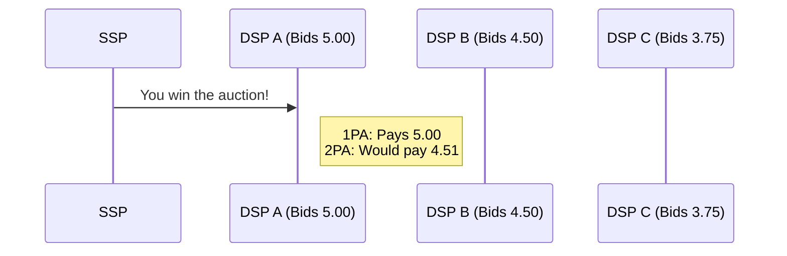

# Mini-DSP Project
This is a simulator for a Demand-Side Platform (DSP) and Supply-Side Platform (SSP), designed to demonstrate:

* **Real-time bidding (RTB) workflow** – request, bid, feedback loops.
* **Bit-flag audience targeting** for fast campaign matching.
* **Concurrent, in-memory stores**, easily swappable with Redis or SQL 
* Console simulation or standalone web APIs
---

## Table of Contents
1. [Architecture](#architecture)
1. [Repo Layout](#repo-layout)
1. [Quick Start](#quick-start)
1. [Running the APIs](#running-the-apis)
1. [Data Sets](#data-sets)
1. [Core Algorithms](#core-algorithms)
   * [Budget management](#budget-management)
   * [Audience matching](#audience-matching)
   * [Awareness fallback](#awareness-fallback)
   * [Bid tie-breaking](#bid-tie-breaking)

---

## Architecture


* **SSP** emits a `BidRequest` every 500 ms and waits 200 ms for responses.
* Each **DSP** evaluates all eligible campaigns and responds with a BidDecision.
* The **SSP** selects the highest bid and notifies all DSPs of the outcome.
* Only the winner’s **campaign budget** is finally debited.

---

## Repo Layout

| Path              | What lives here                                         |
|-------------------|---------------------------------------------------------|
| **Shared/**       | Shared models (`BidRequest`, `CampaignDetail`, …) and JSON loaders    |
| **DSP.Api/**      | Minimal web API exposing bid, campaign & user endpoints |
| **SSP.Api/**      | SSP event source + feedback fan-out                     |
| **Simulation/**   | Console simulation wiring three DSPs to one SSP         |
| ***.json**        |	Synthetic users and campaign datas                            |

---

## Quick Start

```bash
# 1. Prerequisites
dotnet --version   # Should be 9.0.x

# 2. Build all projects
dotnet build mini-dsp.sln

# 3. Launch the simulation
cd Simulation
dotnet run
```

You should see logs such as:

```
[DSP Alpha] Received BidRequest for user-123
[DSP Alpha] Bidding 2.55 for campaign 93f…
[DSP Alpha] Feedback: Bid 3e7… – WON
```

Hit **Enter** to stop the simulation loop.

---

## Running the APIs

### DSP API

```bash
cd DSP.Api
dotnet run  # http://localhost:5294 by default
```

| Method | Path                                | Purpose                                     |
|--------|-------------------------------------|---------------------------------------------|
| `POST` | `/users`                             | Create/update a user   r                    |
| `GET`  | `/users/{id}`                        | Retrieve user by ID                         |
| `POST` | `/campaigns`                         | Register a new campaign                     |
| `GET`  | `/campaigns/{id}`                    | Retrieve campaign by ID                     |
| `PATCH`| `/campaigns/{id}/budget?newBudget=X` | Update campaign budget cap                  |
| `POST` | `/bid`                               | Evaluate incoming bid request and respond   |
| `POST` | `/feedback`                          | Send feedback (win/loss) and manage refunds |


### SSP API

The SSP is instantiated programmatically in `Simulation/Program.cs`.

To run it independently, wrap Ssp in an HTTP or gRPC host – the logic is framework-agnostic.

---

## Data Sets

| File                     | Records | Notes                                                                               |
|--------------------------|---------|-------------------------------------------------------------------------------------|
| `Shared/users.json`      | 30      | Randomised demographic + location flags generated by `generate_users.py`            |
| `Shared/campaign_*.json` | 5       | Five campaigns with densely populated bidLines generated by `generate_campaigns.py` |

Loaders live in `Shared/Utilities` and return strongly typed lists.  

---

## Core Algorithms

### Budget Management

Every campaign stores:

| Field          | Type    | Meaning                                    |
|----------------|---------|--------------------------------------------|
| `budgetCap`    | decimal | Total budget the advertiser has authorised |
| `BudgetSpent`  | decimal | Finalised spend & in-flight requestt       |
| `RemainingBudget`     | decimal | Budget left in the campaign                |

The remaining budget is therefore:

```csharp
decimal RemainingBudget => Math.Max(BudgetCap - BudgetSpent, 0);
```

#### Budget Deduction Flow

1. **Optimistic Deduction:**  
   When a DSP places a bid, it when the DSP sends a bid it **adds** the bid amount to `BudgetSpent` immediately.

2. **Win Confirmation:**  
   If the bid **wins**, the spent bid becomes **final**.

3. **Loss Refund:**  
   If the bid **loses**, the DSP **refunds** the deducted amount immediately.

This prevents **overdrafts** even under high concurrency because the worst-case remaining budget seen by the bidding loop is *under-estimated*, never over-estimated.

> **Note: We're using a 1PA (First-Price Auction) model.**  
> This means the winning DSP pays exactly what it bids — unlike traditional RTB setups that use 2PA (Second-Price Auction), where the winner pays slightly more than the second-highest bid.
>
> In 1PA, **bid shading strategies** are often used to avoid overpaying, but for now we use direct `BaseBid * BidFactor` pricing for clarity.  
> This also makes budget accounting more deterministic and testable.




---

### Audience Matching

```csharp
var userFlags = TargetingExtensions.ToFlags(user.TargetingData);
var bidFlags  = TargetingExtensions.ToFlags(bidLine.TargetingData);
bool match = (userFlags & bidFlags) == bidFlags;
```

A perfect superset match is required.
Partial overlaps do not qualify – all bidLine criteria must be met.
* **Bit-flags** give constant-time checks.
* Densely populated `bidLines` (think “all combinations of age, gender, city, interests”) mean almost any qualified user has a matching line – no fuzzy scoring pass required.

#### Bid Calculation

```csharp
decimal bid = campaign.BaseBid * bidLine.BidFactor;
```

### Awareness Fallback

Campaigns have an optional flag:

```jsonc
{
  "CampaignId": "4d3e70df-f36e-42ef-9c02-77a87103e5b5"",
  "BaseBid": 100,
  ...
  "forAwareness": true
}
```

*If* **no `bidLine` matches** **and** `forAwareness == true`, the DSP will place a **default bid = baseBid**.  
Great for **brand-lift experiments** or launching in a new market where user data is spotty.  
Otherwise, the DSP would not bid for that campaign.

### Bid Tie-Breaking

Two campaigns inside one DSP may sometimes generate **identical bid amounts**.  
Instead of always picking the first match, use a round-robin selection among all campaigns that tie at the highest bid.

* For every tied group of campaigns bidding X, it keeps a rotating pointer (ring buffer).
* Each time a bid comes in and X is the max bid, the next campaign in line is chosen.
* This avoids "first-in-list" bias and spreads impressions evenly among tied bids.
---
