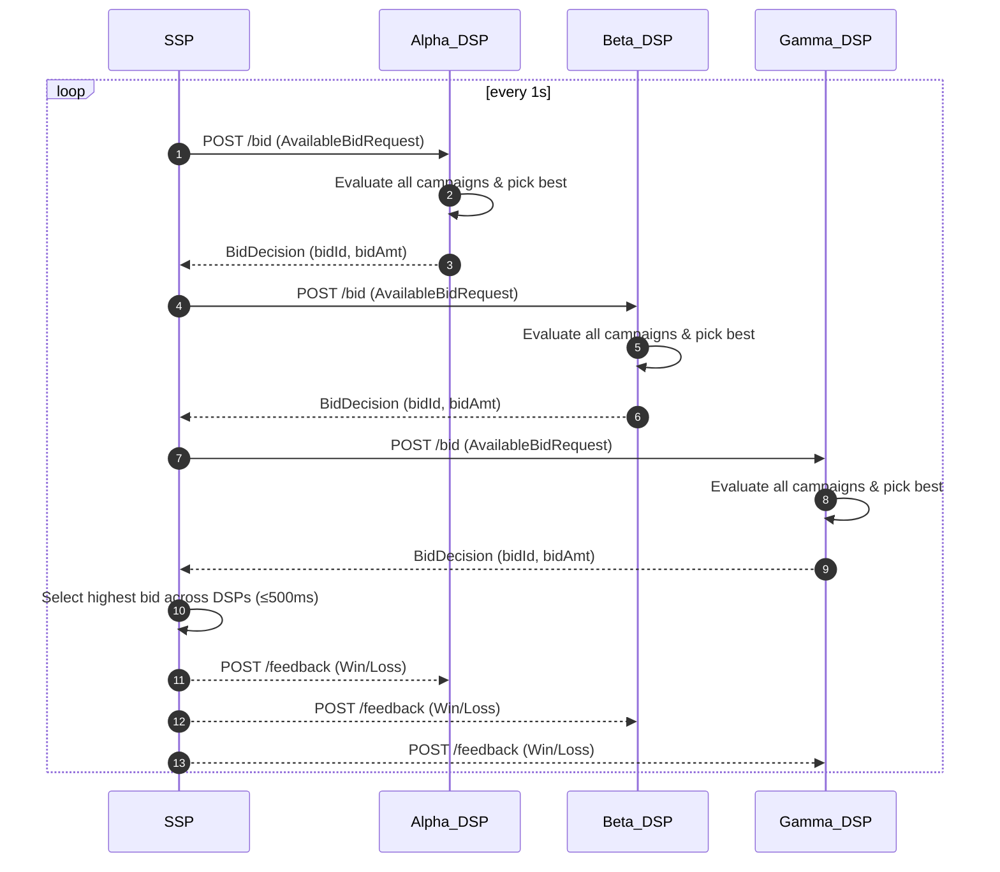

# Mini-DSP Project
This is a simulator for a Demand-Side Platform (DSP) and Supply-Side Platform (SSP), designed to demonstrate:

* **Real-time bidding (RTB) workflow** – request, bid, feedback loops.
* **Bit-flag audience targeting** for fast campaign matching.
* **Concurrent, in-memory stores**, easily swappable with Redis or SQL
---

## 1. Architecture at a Glance



* **SSP** emits a `BidRequest` every 500 ms and waits 200 ms for responses.
* Each **DSP** evaluates all eligible campaigns and responds with a BidDecision.
* The **SSP** selects the highest bid and notifies all DSPs of the outcome.
* Only the **winning DSP** has its campaign budget decremented.

---

## 2. Repo Layout

| Path              | What lives here                                         |
|-------------------|---------------------------------------------------------|
| **Shared/**       | Shared models (`BidRequest`, `CampaignDetail`, etc.)    |
| **DSP.Api/**      | Minimal web API exposing bid, campaign & user endpoints |
| **SSP.Api/**      | SSP event source + feedback fan-out                     |
| **Simulation/**   | Console simulation wiring three DSPs to one SSP         |
| ***.json**        |	Synthetic datasets for users and campaigns                            |

---

## 3. Quick Start

```bash
# 1. Prerequisites
dotnet --version   # Should be 9.0.x

# 2. Build all projects
dotnet build mini-dsp.sln

# 3. Launch the simulation
cd Simulation
dotnet run
```

You should see logs such as:

```
[DSP Alpha] Received BidRequest for user-123
[DSP Alpha] Bidding 2.55 for campaign 93f…
[DSP Alpha] Feedback: Bid 3e7… – WON
```

Press **Enter** to stop the simulation loop.

---

## 4. Running APIs in Isolation

### DSP API

```bash
cd DSP.Api
dotnet run  # Default: http://localhost:5294
```

Key endpoints:
### DSP API – Key Endpoints

| Method | Path                                | Purpose                                     |
|--------|-------------------------------------|---------------------------------------------|
| `POST` | `/users`                             | Create or update a user                     |
| `GET`  | `/users/{id}`                        | Retrieve user by ID                         |
| `POST` | `/campaigns`                         | Register a new campaign                     |
| `GET`  | `/campaigns/{id}`                    | Retrieve campaign by ID                     |
| `PATCH`| `/campaigns/{id}/budget?newBudget=X` | Update campaign budget                      |
| `POST` | `/bid`                               | Evaluate incoming bid request and respond   |
| `POST` | `/feedback`                          | Send feedback (win/loss) and manage refunds |


### SSP API

The SSP is instantiated programmatically in `Simulation/Program.cs`.

To run it independently, wrap Ssp in an HTTP or gRPC host – the logic is framework-agnostic.

---

## 5. Data Sets

| File                     | Records | Notes                                                                               |
|--------------------------|---------|-------------------------------------------------------------------------------------|
| `Shared/users.json`      | 30      | Randomised demographic + location flags generated by `generate_users.py`            |
| `Shared/campaign_*.json` | 5       | Five campaigns with densely populated bidLines generated by `generate_campaigns.py` |

Loaders live in `Shared/Utilities` and return strongly typed lists.  

---

## 6. Core Algorithms

### Audience Matching

```csharp
var userFlags = TargetingExtensions.ToFlags(user.TargetingData);
var bidFlags  = TargetingExtensions.ToFlags(bidLine.TargetingData);
bool match = (userFlags & bidFlags) == bidFlags;
```

A perfect superset match is required.

Partial overlaps do not qualify – all bidLine criteria must be met.

### Bid Calculation

```csharp
decimal bid = campaign.BaseBid * bidLine.BidFactor;
```
#### Budget Deduction Flow

1. **Optimistic Deduction:**  
   When a DSP places a bid, it **tentatively deducts** the bid amount from the campaign's budget.

2. **Win Confirmation:**  
   If the bid **wins**, the deduction becomes **final**.

3. **Loss Refund:**  
   If the bid **loses**, the DSP **refunds** the deducted amount immediately.

This ensures real-time bidding performance while maintaining accurate and thread-safe budget tracking.

