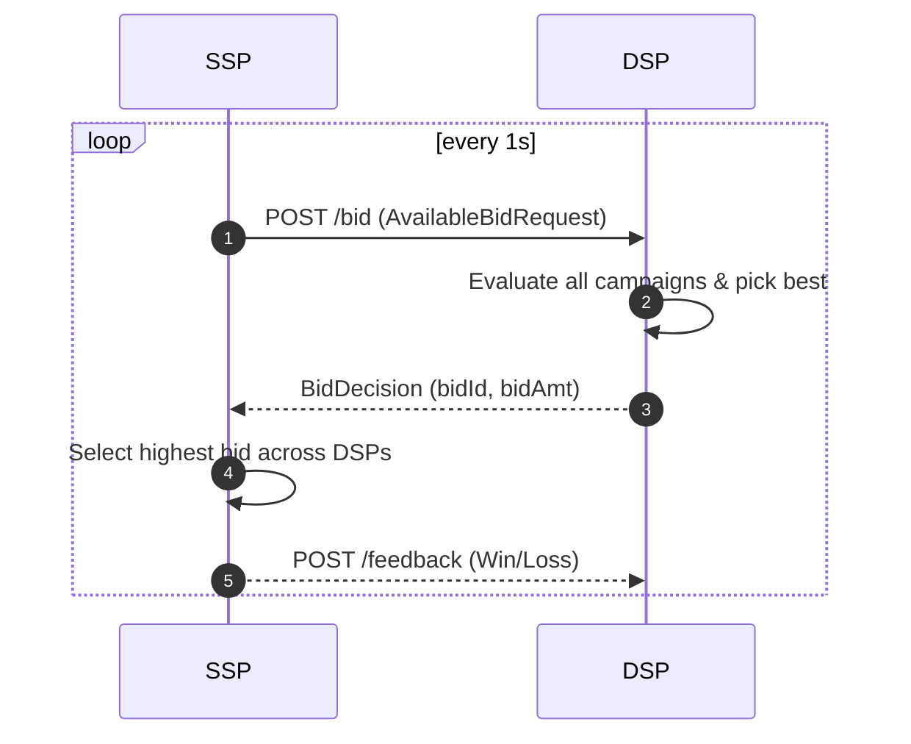

### Running the project
```aiignore
cd .\Simulation\
dotnet run
```


### Flow


### APIs

#### User‑Data Endpoints

| Verb & Path       | Body        | Response (200) |
|-------------------|-------------|----------------|
| `POST /users`     | `UserData`  | `UserData` (created) |
| `GET /users/{id}` | –           | `UserData`     |

#### Campaign Endpoints

| Verb & Path                          | Body                | Response        |
|-------------------------------------|---------------------|-----------------|
| `POST /campaigns`                   | `CampaignDetail`    | `CampaignDetail` (created) |
| `GET /campaigns/{id}`               | –                   | `CampaignDetail` |
| `PATCH /campaigns/{id}/budget`      | `{ "budget": 100 }` | `204 No Content` |


#### Bidder Endpoints

| Verb & Path         | Body           | Response        |
|---------------------|----------------|-----------------|
| `POST /bid`         | `BidRequest`   | `BidDecision`   |
| `POST /feedback`    | `BidFeedback`  | `204 No Content` |


### Objective

Build a simplified DSP with the following components:

#### User Data Management
- API to upload user data
- API to read user data based on key
- User data store

#### Campaign Management
- API to add campaigns
- API to get campaign details based on key
- API to update campaign budget
- Campaign store

#### Bidder
- API to evaluate campaign with highest bid amount matching to bid request
- API to receive bid feedback
- Bids store

#### User Data Store

UserData
- UserId
- TargetingData[]

TargetingData: { Male, Female, HighIncomeCategory, Age_band_25_to_35, Age_band_35_to_50, LivesInMetroArea, LivesInRegionalArea }

#### Campaign Store

CampaignDetail
- CampaignId
- Budget
- RemainingBudget
- BaseBid
- BidLine[]

BidLine
- TargetingData[]
- BidFactor

#### Bids Store

BidRequest
- BidId
- CampaignId
- BidAmount

BidFeedback
- BidId
- Win/Loss

# Reference links

- [GitLab CI Documentation](https://docs.gitlab.com/ee/ci/)
- [.NET Hello World tutorial](https://dotnet.microsoft.com/learn/dotnet/hello-world-tutorial/)

If you're new to .NET you'll want to check out the tutorial, but if you're
already a seasoned developer considering building your own .NET app with GitLab,
this should all look very familiar.

## What's contained in this project

The root of the repository contains the out of the `dotnet new console` command,
which generates a new console application that just prints out "Hello, World."
It's a simple example, but great for demonstrating how easy GitLab CI is to
use with .NET. Check out the `Program.cs` and `dotnetcore.csproj` files to
see how these work.

In addition to the .NET Core content, there is a ready-to-go `.gitignore` file
sourced from the .NET Core [.gitignore](https://github.com/dotnet/core/blob/master/.gitignore). This
will help keep your repository clean of build files and other configuration.

Finally, the `.gitlab-ci.yml` contains the configuration needed for GitLab
to build your code. Let's take a look, section by section.

First, we note that we want to use the official Microsoft .NET SDK image
to build our project.

```
image: microsoft/dotnet:latest
```

We're defining two stages here: `build`, and `test`. As your project grows
in complexity you can add more of these.

```
stages:
    - build
    - test
```

Next, we define our build job which simply runs the `dotnet build` command and
identifies the `bin` folder as the output directory. Anything in the `bin` folder
will be automatically handed off to future stages, and is also downloadable through
the web UI.

```
build:
    stage: build
    script:
        - "dotnet build"
    artifacts:
      paths:
        - bin/
```

Similar to the build step, we get our test output simply by running `dotnet test`.

```
test:
    stage: test
    script: 
        - "dotnet test"
```

This should be enough to get you started. There are many, many powerful options
for your `.gitlab-ci.yml`. You can read about them in our documentation
[here](https://docs.gitlab.com/ee/ci/yaml/).

## Developing with Gitpod

This template repository also has a fully-automated dev setup for [Gitpod](https://docs.gitlab.com/ee/integration/gitpod.html).

The `.gitpod.yml` ensures that, when you open this repository in Gitpod, you'll get a cloud workspace with .NET Core pre-installed, and your project will automatically be built and start running.

Godspeed!